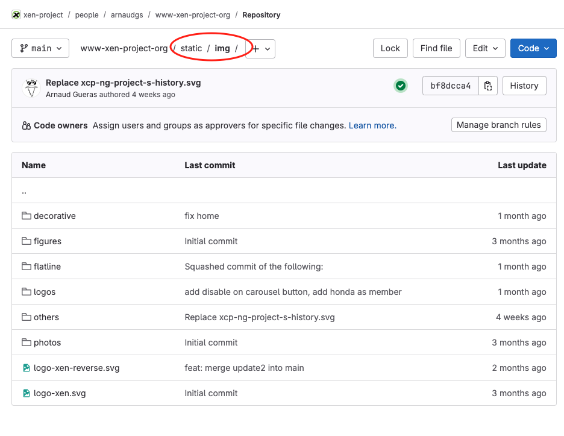
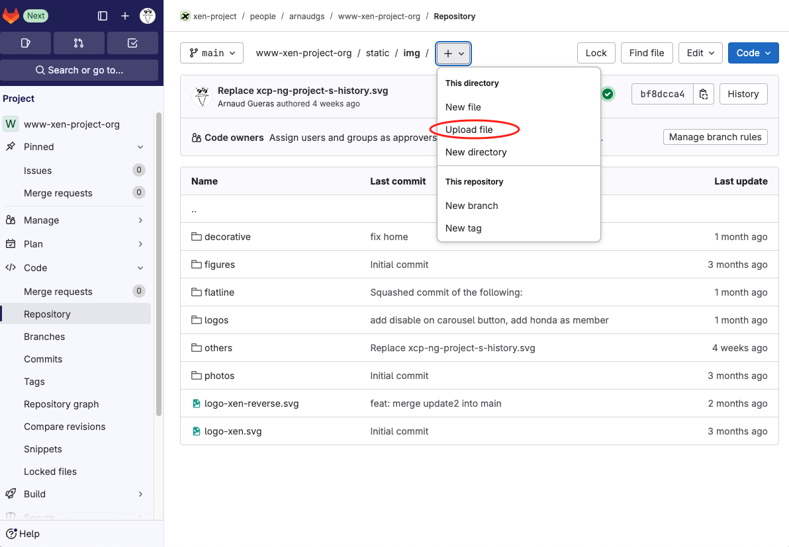
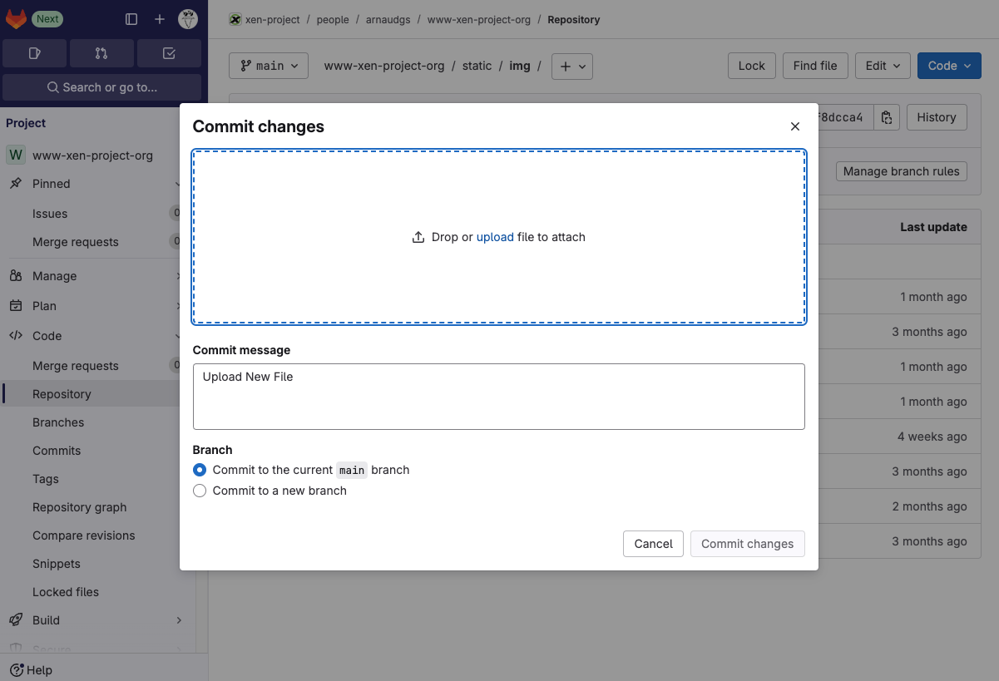
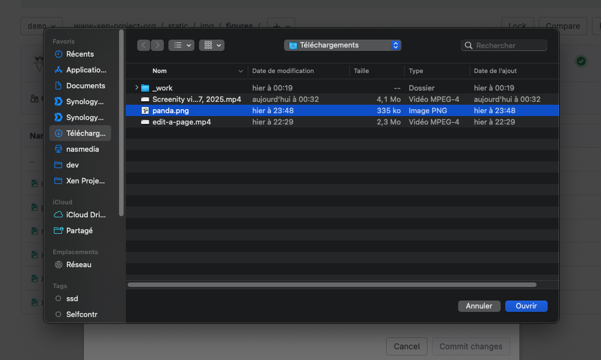
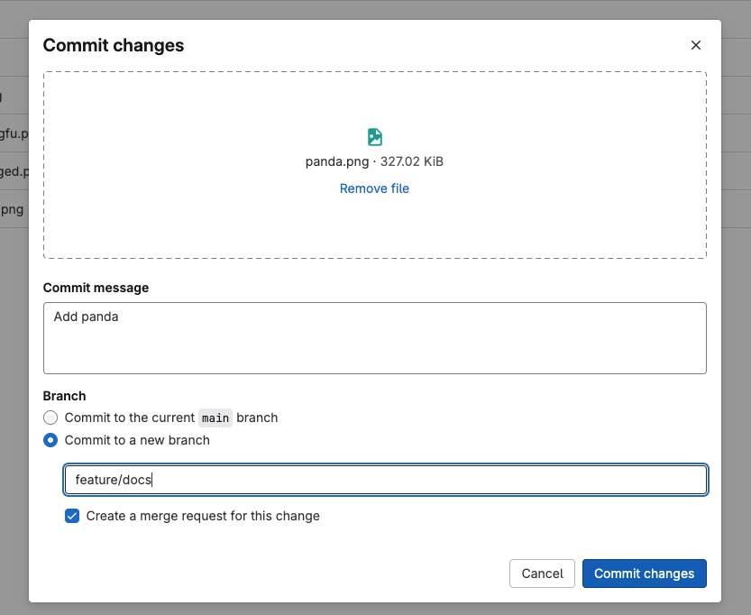
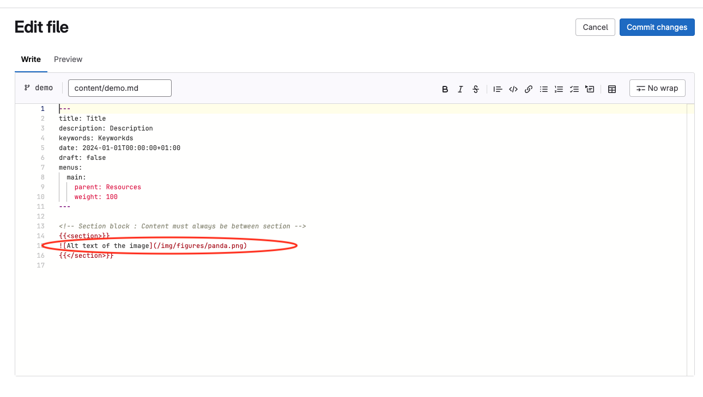

# Add an image

## Video of this tutorial

<video src="videos/add-an-image.mp4" controls></video>

[Download video](videos/add-an-image.mp4)

## Tutorial

- Go to folder `static/img`
- Go to a subfolder of `static/img` according to the type of the image (for example `static/img/figures`)

- Clic on the button ` +`

- Choose `Upload file`

- Clic on upload or drag and drop your image

- Clic on the button `Commit changes`

- Return to the `content` folder for the pages
- Edit the page and add the image in the page

- Clic on the button `Commit changes`
- And clic again on `Commit changes`

