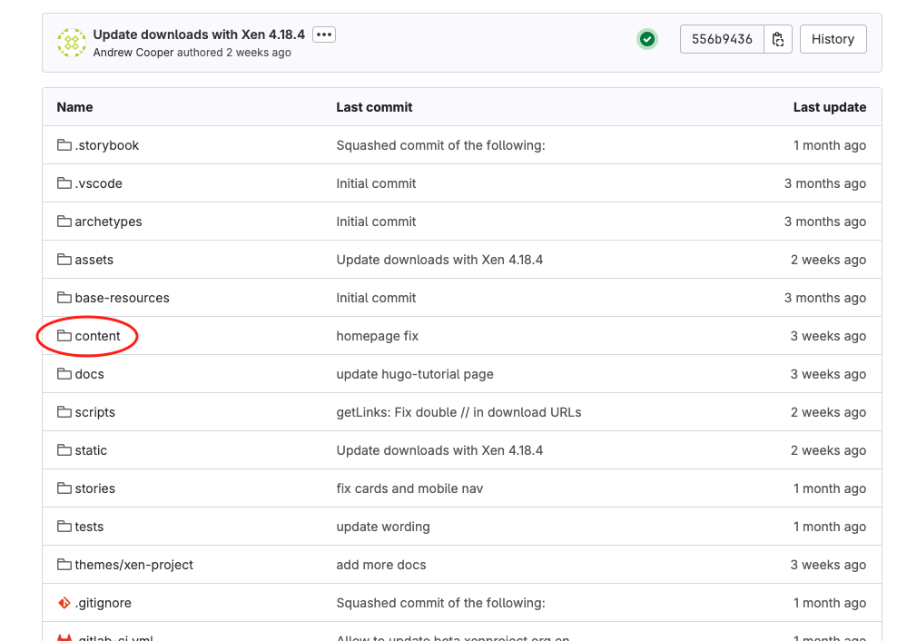
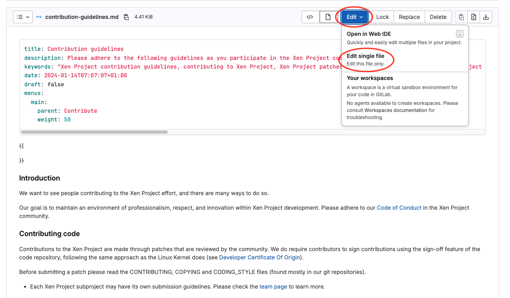
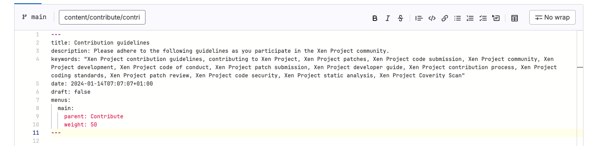
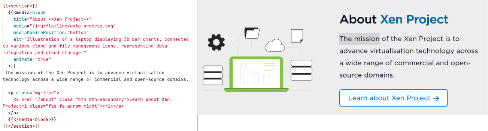
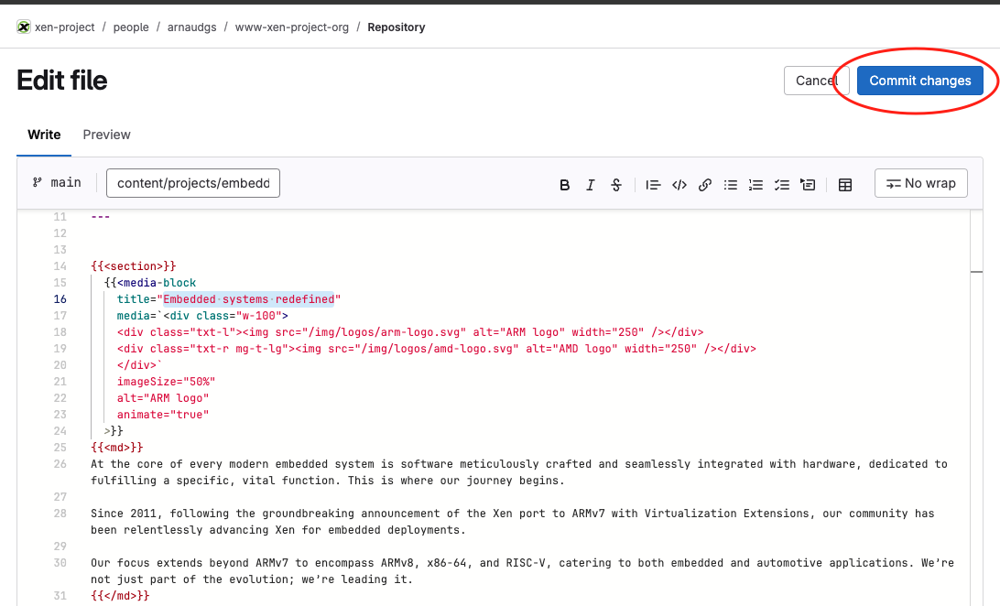
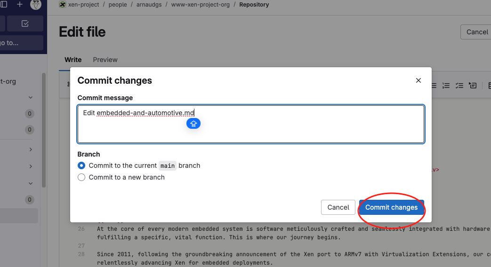

# Update content of a page

## Video of this tutorial

<video src="videos/edit-a-page.mp4" controls></video>


# Tutorial

## Go to the page

- Go to the `content` folder
  


- Open the page you want to update
- Click on Edit -> Edit single file




## Update the Header of the page

The front matter is the metadata at the top of each page file. It includes information like the page title, description, and other settings.

You can have more information of the front matter here : [Front matter](page-editing.md#front-matter)

> **Warning**: Any change of the front matter of a page could change the header (ie: change the title of the page)




### Default Parameters

Based on analysis of typical pages, the front matter usually includes:

| Parameter   | Description                                                                                                   |
| ----------- | ------------------------------------------------------------------------------------------------------------- |
| title       | The page title                                                                                                |
| description | A brief description of the page                                                                               |
| keywords    | Keywords for the page, used for SEO                                                                           |
| layout      | The layout type used for the page, all the pages use the layout "single"                                      |
| date        | Publication date (often used for blog posts)                                                                  |
| draft       | If the page is a draft, set to true, if the page is ready and published, set to false or delete the parameter |

These parameters help structure and organize the site content while providing useful metadata for SEO and navigation.

The parameters `title`, `description` are use for the main title and description of the page. You can see them at the top of the page.

The parameters `title`, `description` and `keywords` are used for SEO and are used to help search engines understand the content of the page.

The parameter `draft` is used to indicate if the page is a draft or not. If the page is a draft, it will not be published.


### Show a page in the menu

By default, all the pages are shown in the menu. If you don't want to show a page in the menu, you can set the `hidden` parameter to `true`.

The pages are grouped into folders, but their position in the menu is determined by the `menu.main` and `weight` parameters.

To order the pages in the menu, you can set the `weight` parameter to the desired value. The lower the number, the higher up in the menu the page will be.

Example : 


**Page downloads.md**

```yaml
title: Downloads
menus:
  main:
    parent: Resources
    weight: 50
```

**Page Matrix.md**

```yaml
title: Matrix
menus:
  main:
    parent: Resources
    weight: 70
```

The page **Matrix** is after the page **Downloads** in the menu because it has a higher `weight` value.

# Update the content

All the content below the front matter is the content of the page.

You can use markdown to format your content.

In the context of the project, all block of a page are inside `<section>` tags.

## blocks of a page are always inside `` block
  ```markdown
       
      content
    
  ```

If you only want to write text inside a section you can use the attribute `md="true"` on a `section` tag.

```markdown
   
  content

```

Or you can mix components and <md> tags.

```markdown
   
  
    markdown **content**
  
   ... 

  
    markdown content
  

```

Example : 


## Components:

All Component can be seen in the page [Components](components.md)

## Save the page

- Clic on the button `Commit changes`



- Write a message for the commit
- Verify the branch is `main` if you want to make a change in production.
- Clic on the button `Commit changes`



