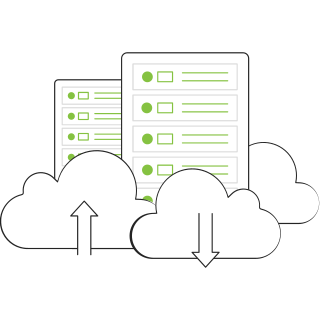
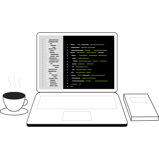
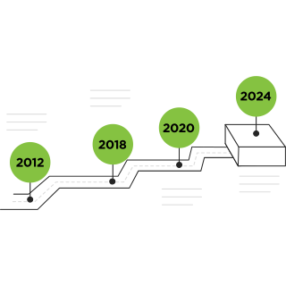
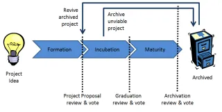
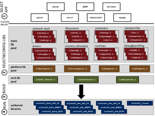
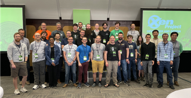

# Images

This document lists all available images in the project with their paths and usage examples.

## List of images

### home-servers.webp


**Path:** `/img/decorative/home-servers.webp`

**Usage Examples:**

```markdown

```

```markdown

```
### home-shadow-screen.png


**Path:** `/img/decorative/home-shadow-screen.png`

**Usage Examples:**

```markdown

```

```markdown

```
### home-wire.png


**Path:** `/img/decorative/home-wire.png`

**Usage Examples:**

```markdown

```

```markdown

```
### screen-with-wire.svg


**Path:** `/img/decorative/screen-with-wire.svg`

**Usage Examples:**

```markdown

```

```markdown

```
### cloud.png


**Path:** `/img/figures/cloud.png`

**Usage Examples:**

```markdown

```

```markdown

```
### small-cloud.png


**Path:** `/img/figures/small-cloud.png`

**Usage Examples:**

```markdown

```

```markdown

```
### xen-panda-kungfu.png


**Path:** `/img/figures/xen-panda-kungfu.png`

**Usage Examples:**

```markdown

```

```markdown

```
### xen-panda-winged.png


**Path:** `/img/figures/xen-panda-winged.png`

**Usage Examples:**

```markdown

```

```markdown

```
### xen-panda-zen.png


**Path:** `/img/figures/xen-panda-zen.png`

**Usage Examples:**

```markdown

```

```markdown

```
### brainstorming-session.svg


**Path:** `/img/flatline/brainstorming-session.svg`

**Usage Examples:**

```markdown

```

```markdown

```
### brainstorming.svg


**Path:** `/img/flatline/brainstorming.svg`

**Usage Examples:**

```markdown

```

```markdown

```
### coding.svg


**Path:** `/img/flatline/coding.svg`

**Usage Examples:**

```markdown

```

```markdown

```
### coding2.svg


**Path:** `/img/flatline/coding2.svg`

**Usage Examples:**

```markdown

```

```markdown

```
### data-analysis.svg


**Path:** `/img/flatline/data-analysis.svg`

**Usage Examples:**

```markdown

```

```markdown

```
### data-analyst.svg


**Path:** `/img/flatline/data-analyst.svg`

**Usage Examples:**

```markdown

```

```markdown

```
### data-center.svg


**Path:** `/img/flatline/data-center.svg`

**Usage Examples:**

```markdown

```

```markdown

```
### data-hosting.svg



**Path:** `/img/flatline/data-hosting.svg`

**Usage Examples:**

```markdown

```

```markdown

```
### data-process-with-xen-logo.svg


**Path:** `/img/flatline/data-process-with-xen-logo.svg`

**Usage Examples:**

```markdown

```

```markdown

```
### data-process.svg


**Path:** `/img/flatline/data-process.svg`

**Usage Examples:**

```markdown

```

```markdown

```
### data-process2.svg


**Path:** `/img/flatline/data-process2.svg`

**Usage Examples:**

```markdown

```

```markdown

```
### data-storage.svg


**Path:** `/img/flatline/data-storage.svg`

**Usage Examples:**

```markdown

```

```markdown

```
### data_and_settings.svg


**Path:** `/img/flatline/data_and_settings.svg`

**Usage Examples:**

```markdown

```

```markdown

```
### error-404.svg


**Path:** `/img/flatline/error-404.svg`

**Usage Examples:**

```markdown

```

```markdown

```
### handshake.svg


**Path:** `/img/flatline/handshake.svg`

**Usage Examples:**

```markdown

```

```markdown

```
### java.svg



**Path:** `/img/flatline/java.svg`

**Usage Examples:**

```markdown

```

```markdown

```
### laptop-cybersecurity.svg


**Path:** `/img/flatline/laptop-cybersecurity.svg`

**Usage Examples:**

```markdown

```

```markdown

```
### new-message.svg


**Path:** `/img/flatline/new-message.svg`

**Usage Examples:**

```markdown

```

```markdown

```
### screen-with-xen-logo.webp


**Path:** `/img/flatline/screen-with-xen-logo.webp`

**Usage Examples:**

```markdown

```

```markdown

```
### security.svg


**Path:** `/img/flatline/security.svg`

**Usage Examples:**

```markdown

```

```markdown

```
### start-up.svg


**Path:** `/img/flatline/start-up.svg`

**Usage Examples:**

```markdown

```

```markdown

```
### team-meeting.svg


**Path:** `/img/flatline/team-meeting.svg`

**Usage Examples:**

```markdown

```

```markdown

```
### team-work.svg


**Path:** `/img/flatline/team-work.svg`

**Usage Examples:**

```markdown

```

```markdown

```
### timeline.svg



**Path:** `/img/flatline/timeline.svg`

**Usage Examples:**

```markdown

```

```markdown

```
### logo-xen-reverse.svg


**Path:** `/img/logo-xen-reverse.svg`

**Usage Examples:**

```markdown

```

```markdown

```
### logo-xen.svg


**Path:** `/img/logo-xen.svg`

**Usage Examples:**

```markdown

```

```markdown

```
### amd-logo.svg


**Path:** `/img/logos/amd-logo.svg`

**Usage Examples:**

```markdown

```

```markdown

```
### arm-logo.svg


**Path:** `/img/logos/arm-logo.svg`

**Usage Examples:**

```markdown

```

```markdown

```
### aws-logo.svg


**Path:** `/img/logos/aws-logo.svg`

**Usage Examples:**

```markdown

```

```markdown

```
### epam-logo.svg


**Path:** `/img/logos/epam-logo.svg`

**Usage Examples:**

```markdown

```

```markdown

```
### honda-logo.svg


**Path:** `/img/logos/honda-logo.svg`

**Usage Examples:**

```markdown

```

```markdown

```
### logo-linux-foundation.svg


**Path:** `/img/logos/logo-linux-foundation.svg`

**Usage Examples:**

```markdown

```

```markdown

```
### vates-logo.svg


**Path:** `/img/logos/vates-logo.svg`

**Usage Examples:**

```markdown

```

```markdown

```
### xenserver-logo.svg


**Path:** `/img/logos/xenserver-logo.svg`

**Usage Examples:**

```markdown

```

```markdown

```
### governance-xen_projectstages.webp



**Path:** `/img/others/governance-xen_projectstages.webp`

**Usage Examples:**

```markdown

```

```markdown

```
### unikraft-architecture.png



**Path:** `/img/others/unikraft-architecture.png`

**Usage Examples:**

```markdown

```

```markdown

```
### xcp-ng-badge.webp


**Path:** `/img/others/xcp-ng-badge.webp`

**Usage Examples:**

```markdown

```

```markdown

```
### xcp-ng.png


**Path:** `/img/others/xcp-ng.png`

**Usage Examples:**

```markdown

```

```markdown

```
### xen-progress-certification.png


**Path:** `/img/others/xen-progress-certification.png`

**Usage Examples:**

```markdown

```

```markdown

```
### xen-team-photo-1.png


**Path:** `/img/others/xen-team-photo-1.png`

**Usage Examples:**

```markdown

```

```markdown

```
### xen-team-photo-2.png



**Path:** `/img/others/xen-team-photo-2.png`

**Usage Examples:**

```markdown

```

```markdown

```
### xen-project-2023-group-photo.png


**Path:** `/img/photos/xen-project-2023-group-photo.png`

**Usage Examples:**

```markdown

```

```markdown

```
