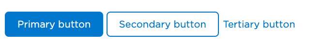
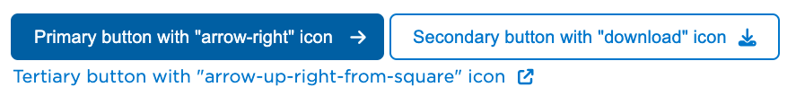

# Advanced Editing


## Buttons



Buttons are used to trigger actions or navigate to other pages. There are three types of buttons available:

### Button Types

- **Primary Button**: Main call-to-action buttons
  ```markdown
  <a href="/path" class="btn btn-primary">Primary button</a>
  ```

- **Secondary Button**: Alternative or secondary actions
  ```markdown
  <a href="/path" class="btn btn-secondary">Secondary button</a>
  ```

- **Tertiary Button**: Less prominent actions
  ```markdown
  <a href="/path" class="btn btn-tertiary">Tertiary button</a>
  ```

### Icons in Buttons



Buttons can include icons from the Font Awesome library. The convention is:

- Internal links use the arrow-right icon:
  ```markdown
  <a href="/internal-page" class="btn btn-primary">
    Internal link <i class="fas fa-arrow-right"></i>
  </a>
  ```

- External links use the external link icon:
  ```markdown
  <a href="https://external-site.com" class="btn btn-primary" target="_blank">
    External link <i class="fas fa-arrow-up-right-from-square"></i>
  </a>
  ```

- Download links use the download icon:
  ```markdown
  <a href="/download" class="btn btn-secondary">
    Download <i class="fas fa-download"></i>
  </a>
  ```

## Links

Links follow similar conventions to buttons for consistency across the site:

### Link Types

- **Internal links**: Use regular markdown syntax or HTML
  ```markdown
  [Internal link](/internal-page)
  ```
  or
  ```markdown
  <a href="/internal-page">Internal link</a>
  ```

- **External links**: Include target="_blank" to open in new tab
  ```markdown
  <a href="https://external-site.com" target="_blank">
    External link <i class="fas fa-arrow-up-right-from-square"></i>
  </a>
  ```

- **Download links**: Include the download icon
  ```markdown
  <a href="/path/to/file.pdf">
    Download PDF <i class="fas fa-download"></i>
  </a>
  ```


## Using Components

To use a component, simply copy the desired component code and paste it into your Markdown file. You can customize the content and parameters according to your needs.

## Component Customization

Each component can be customized with different parameters. Here are some examples:

## Best Practices

- Use components consistently throughout the site
- Avoid overloading a page with too many components

## Advanced Tips

- You can nest certain components within each other
- Components can be used on any page of the site
- Some components accept Markdown inside them