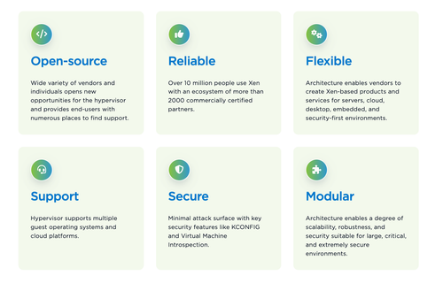
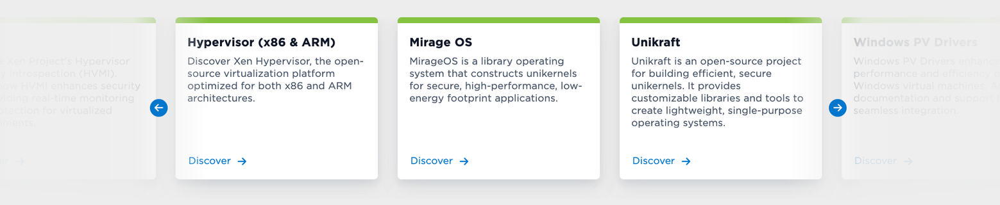
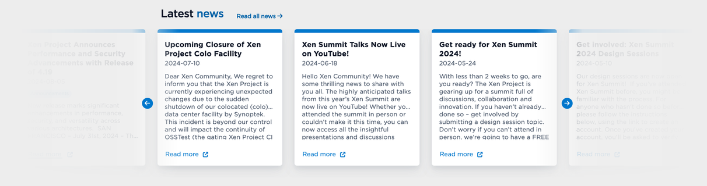
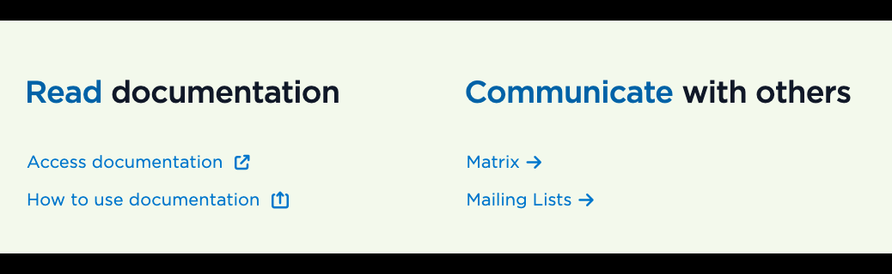

# Components

This page describes the use of reusable components.

There are predefined components that you can insert into your pages. They help maintain visual and functional consistency throughout the site.

Here are the main components you can use:

Click on the component image to see the full documentation.

### Media-block

### Features List

### Carousel

### Latest News

### Vertical Lists

