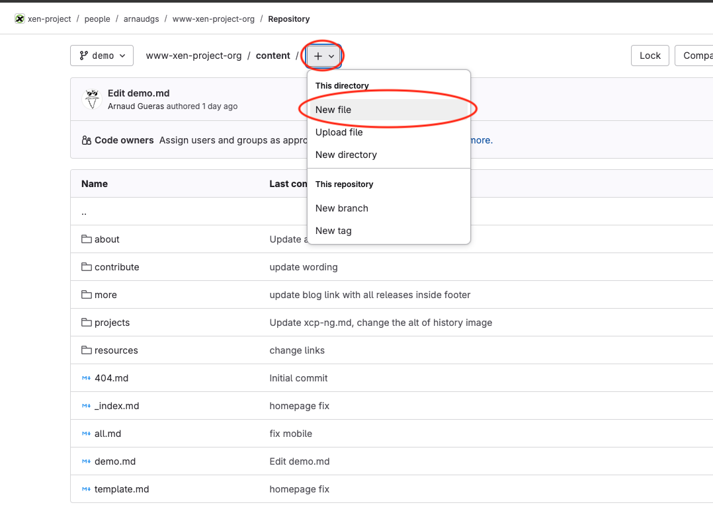
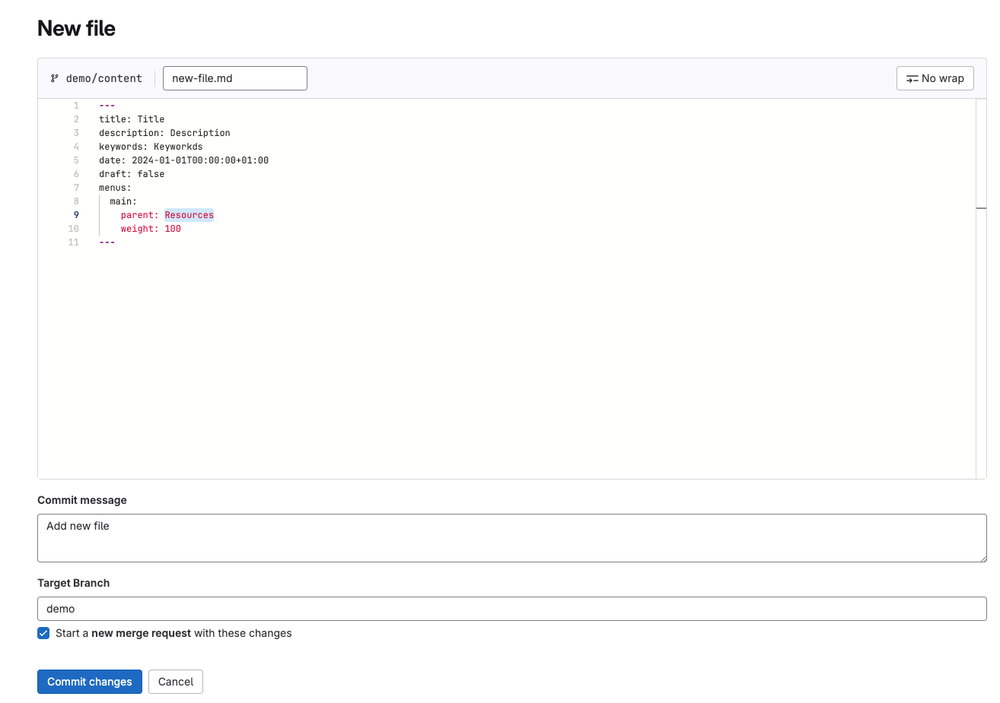

# Create a new page

## Video of this tutorial

<video controls src="../videos/create-a-new-page.mp4" title="Title"></video>

[Download video](../videos/create-a-new-page.mp4)

## Create a new file

Click on the "+" icon and select `New file`



## Start editing the file

Enter the new file name of the file



Add the front matter of the page

You can use this example as a template : 

```markdown
---
title: Title
description: Description
keywords: Keywords
date: 2024-01-01T00:00:00+01:00
draft: false
menus:
  main:
    parent: Resources
    weight: 100
---
```

For more information about the front matter, you can read the [Front matter documentation](page-editing.md#front-matter)

Add the content of the page between, dont forget each part of section must be between the `` and `` tags

## Save the page

- Check the branch name and the commit message
- Clic on the button `Commit changes`

